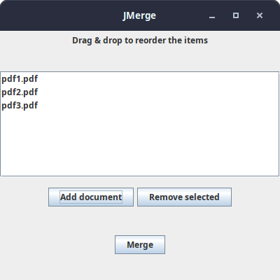

# jMerge - minimal PDF merger

This is a small hobby project to make life a little bit easier. JMerge is a free, open-source, offline PDF document merger.

# Usage

You can either build the tool by yourself, or download it.

## By downloading

Download from [https://github.com/ekelhala/jmerge/releases/latest](https://github.com/ekelhala/jmerge/releases/latest)

## From source

Clone this repo with `git clone https://github.com/ekelhala/jmerge.git`

Build it with `mvn clean compile assembly:single` in the repo folder (`jmerge`)

# Possible improvements

- Making code cleaner and mode modular
- Implementing a config file system, where `.pdf` files could be fetched and merged by looking at a file generated by some other program
